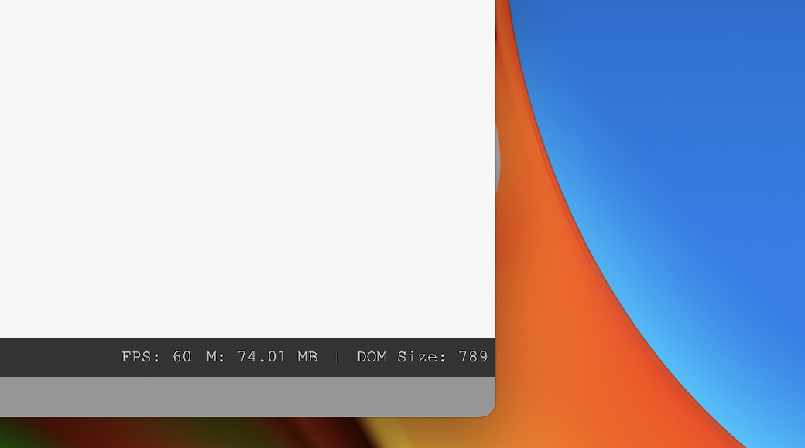

<div align="center">
  
  <h1 align="center">
    Dev Toolbar
  </h1>
  <p>Dev Toolbar is a simple utility that runs in the browser to help you glance at your web application's performance. Originally built for [featureOS](https://featureos.app).</p>
</div>



A simple developer toolbar for react based apps.

## Dev Toolbar Features
These are the metrics Dev Toolbar shows right now:

- FPS
- Memory
- DOM elements size

### Planned
These are some of the planned features. Also [submit a new issue](https://github.com/skcript/dev-toolbar/issues/new) over here if you need some more to be incorporated.

- [Chrome Extension](https://github.com/skcript/dev-toolbar/issues/3)
- Dark and light mode
- Custom buttons
- Areas (islands) to render whatever you want

## Installation

```bash
npm install devbar
```

## Usage

```jsx
import React from 'react'
import DevBar from 'devbar'

const App = () => {
  return (
    <div>
      <h1>Hello World</h1>
      <DevBar />
    </div>
  )
}
```

## Contributing

1. Fork it!
2. Create your feature branch: `git checkout -b feat-{feature-name}`
3. Commit your changes: `git commit -am 'Add some feature'`
4. Push to the branch: `git push origin feat-{feature-name}`
5. Submit a pull request :D

---

## Sponsored by

<a href='https://featureos.app'>

</a>
